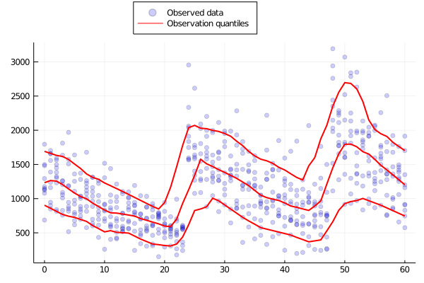

# Visual Predictive Check (VPC)

Pumas allows you to generate VPC quantiles for your data and model simulations
and utilize the Julia plotting capabilities to generate the relevant VPC plots.
This is allowed with the `vpc` function discuseed below that returns a `VPC` object.

```julia
 vpc(fpm::FittedPumasModel,
                reps::Integer = 499,
                qreg_method = IP(),
                vpctype::VPCType = ContinuousVPC();
                dv::Symbol = keys(fpm.data[1].observations)[1],
                stratify_by = nothing,
                quantiles::NTuple{3,Float64}=(0.1, 0.5, 0.9),
                level::Real=0.95,
                ensemblealg=EnsembleSerial(),
                bandwidth=2,
                numstrats=stratify_by === nothing ? nothing : [4 for i in 1:length(stratify_by)])
```
`vpc` computes the quantiles for VPC for a `FittedPumasModel` with simulated prediction intervals 
around the empirical quantiles based on `reps` simulated populations.

The number of repetitions of simulation are passed in with the `reps` positional argument. 

The following keyword arguments are supported:

    - `quantiles::NTuple{3,Float64}`: A three-tuple of the quantiles for which the quantiles will be computed. The default is `(0.1, 0.5, 0.9)` which computes the 10th, 50th and 90th percentile.
    - `level::Real`: Probability level to use for the simulated prediction intervals. The default is `0.95`.
    - `dv::Symbol`: The name of the dependent variable to use for the VPCs, passed in as a `Symbol`. The default is the first dependent variable in the dataset.
    - `stratify_by`: The covariates to be used for stratification. Takes an array of the `Symbol`s of the stratification covariates.
    - `ensemblealg`: This is passed to the `simobs` call while the `reps` simulations. For more description check the docs for `simobs`.
    - `bandwidth`: The kernel bandwidth in the quantile regression. If you are seeing `NaN`s or an error, increasing the bandwidth should help in most cases. With higher values of the `bandwidth` you will get more smoothened plots of the quantiles so it's a good idea to check with your data the right `bandwidth`.
    - `numstrats`: The number of strata to divide into based on the unique values of the covariate, takes an array with the number of strata for the corresponding covariate passed in `stratify_by`. It takes a default of `4` for each of the covariates.

Hence a `vpc` call with 100 `nreps` would be:

```julia
 res = fit(model,data,param,Pumas.FOCEI())
 vpc_fpm = vpc(res, 100)
```

Stratification on `wt` covariate

```julia
 vpc_fpm_stratwt = vpc(res, stratify_by=[:wt])
 #run only 100 simulations 
 vpc_fpm_stratispm = vpc(res, 100, stratify_by=[:isPM])
```
The `VPC` object obtained as the result contains the following fields:

    - `simulated_quantiles::DataFrame`: `DataFrame` of the simulated quantiles result.
    - `popvpc::PopVPC`: A `PopVPC` object with the observation quantiles (`data_quantiles`), data (`data`), stratification covariate if specified (`stratify_by`) and the dependent variable (`dv`).
    - `level::Float64`: The simulation CI's level. 

Since the quantiles are stored as `DataFrame`s it is very easy to use the result of `vpc` and also 
export it using CSV.jl to your disk.

```julia
 vpc_fpm.simulated_quantiles
 vpc_fpm.popvpc.data_quantiles

 using CSV
 write("sim_quantiles.csv", vpc_fpm.simulated_quantiles)
```

While plotting the obtained `VPC` object with `plot` the following keyword arguments allow the option 
to include or exclude various components with `true` or `false` respectively:

    - `observations`: Scatter plot of the true observations.
    - `simquantile_medians`: The median quantile regression of each quantile from the simulations.
    - `observed_quantiles`: The quantile regressions for the true observations.
    - `ci_bands`: Shaded region between the upper and lower confidence levels of each quantile from the simulations.


!!! info
    
    `observations` and `simquantile_medians` are set to `false` by default.


```julia
 using Plots
 plot(vpc_fpm)
 plot(vpc_fpm, observations = true)
 plot(vpc_fpmstratwt, observations = true, ci_bands = false)
```

### Full examples: 

Let's take a look at a complete example, first we define the model and generate round-trip data.

```julia
 model = @model begin
            @param begin
              tvcl ∈ RealDomain(lower=0)
              tvv ∈ RealDomain(lower=0)
              pmoncl ∈ RealDomain(lower = -0.99)
              Ω ∈ PDiagDomain(2)
              σ_prop ∈ RealDomain(lower=0)
            end

            @random begin
              η ~ MvNormal(Ω)
            end

            @covariates wt isPM

            @pre begin
              CL = tvcl * (1 + pmoncl*isPM) * (wt/70)^0.75 * exp(η[1])
              Vc    = tvv * (wt/70) * exp(η[2])
            end

            @dynamics Central1

            @derived begin
              cp = @. 1000*(Central / Vc)
              dv ~ @. Normal(cp, sqrt(cp^2*σ_prop))
            end
        end

 ev = DosageRegimen(100, time=0, addl=2, ii=24)
 s1 = Subject(id=1, events=ev, covariates=(isPM=1, wt=70))

 param = (
     tvcl = 4.0,
     tvv    = 70,
     pmoncl = -0.7,
     Ω = Diagonal([0.09,0.09]),
     σ_prop = 0.04
     )

 choose_covariates() = (isPM = rand([1, 0]),
 wt = rand(55:80))
 pop_with_covariates = Population(map(i -> Subject(id=i, events=ev, covariates=choose_covariates()),1:10))
 obs = simobs(model, pop_with_covariates, param, obstimes=0:1:60)
 simdf = DataFrame(obs)
 simdf[rand(1:length(simdf.dv), 5), :dv] .= missing
 data = read_pumas(simdf, time=:time, covariates=[:isPM, :wt])
```

One workflow tip we recommend is to use the ability of doing the quantile calculations 
only for the observed data for adjusting the `bandwidth` value (defaults to 2) to get a
good fit.

```julia
 vpc_data = vpc(data)
 plot(vpc_data)
```


```julia
 vpc_data_stratwt = vpc(data, stratify_by=[:wt])
 plot(vpc_data_stratwt)
```


```julia
 vpc_data_stratwt = vpc(data, stratify_by=[:wt], bandwidth = 5)
 plot(vpc_data_stratwt)
```


We see the plot with higher `bandwidth` better captures the data, so we would use the same `bandwidth` value
for VPC stratified on `wt`.  


```julia
 res = fit(model,data,param,Pumas.FOCEI())

 vpc_fpm = vpc(res, 100)
 plot(vpc_fpm)
```


```julia
 vpc_fpm_stratwt = vpc(res, 100, stratify_by=[:wt], bandwidth = 5)
 plot(vpc_fpm_stratwt)
```


!!! note

    For most users the method used in quantile regression is not going to be of concern, but if you see large run times switching `qreg_method` to `IP(true)` after loading QuantileRegressions.jl should help in improving the performance with a tradeoff in the accuracy of the regression fitting.
