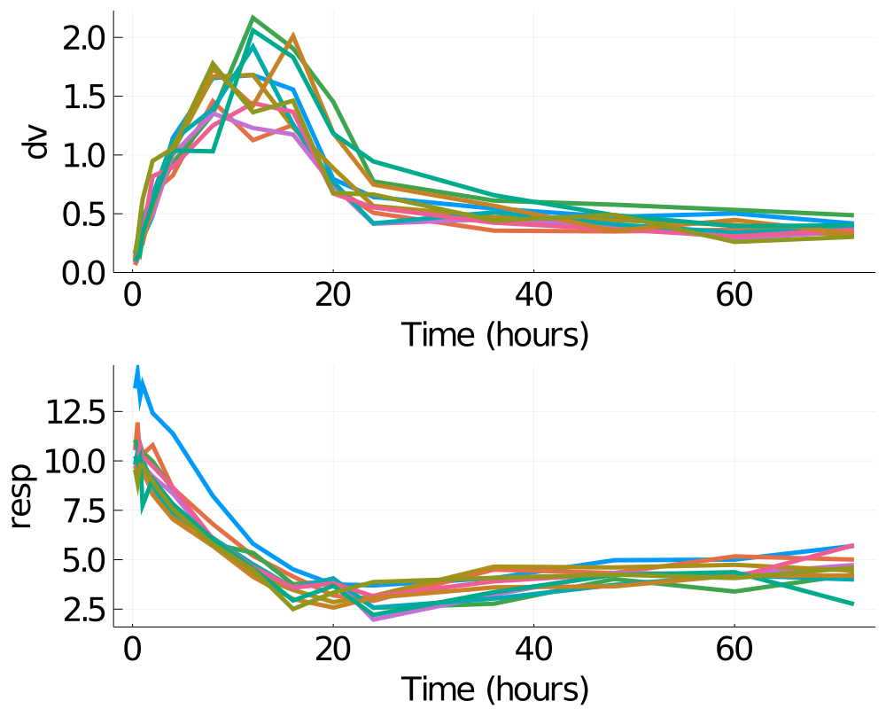
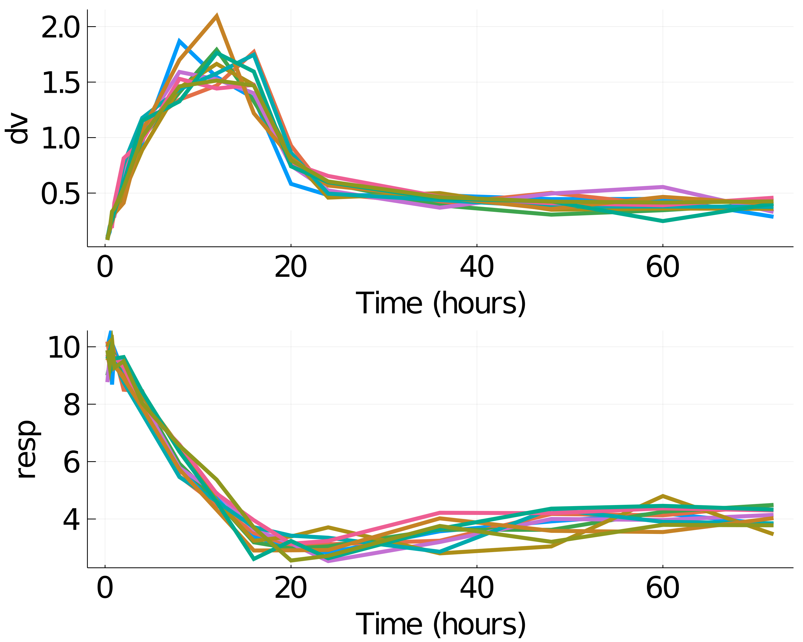
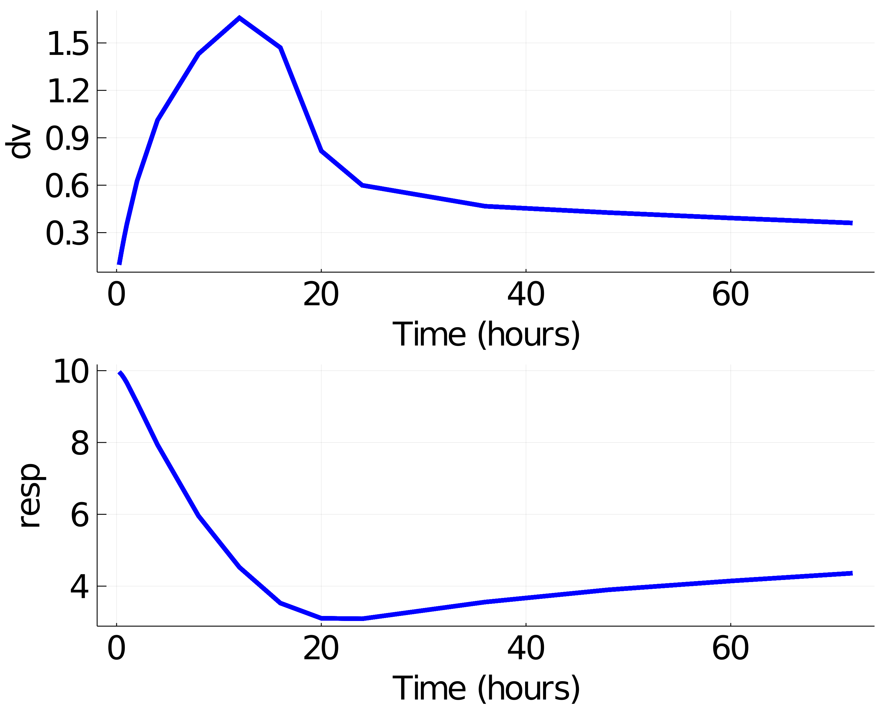

# Introduction to Pumas

This is an introduction to Pumas, a software for pharmaceutical modeling and
simulation.

The basic workflow of Pumas is:

1. Build a model.
2. Define subjects or populations to simulate or estimate.
3. Analyze the results with post-processing and plots.

We will show how to build a multiple-response PK/PD model
via the `@model` macro, define a subject with multiple doses, analyze
the results of the simulation, roudtrip the data for estimation and fit the data
using maximum likelihood methods. This tutorial is made to be a broad overview
of the workflow and more in-depth treatment of each section can be found in
the subsequent tutorials and documentation.

## Working Example

Let's start by showing a complete simulation code, and then break down how it
works.

```julia
using Pumas
using Random
using Plots
```

```julia
######### Turnover model

inf_2cmt_lin_turnover = @model begin
    @param   begin
        tvcl ∈ RealDomain(lower=0)
        tvvc ∈ RealDomain(lower=0)
        tvq ∈ RealDomain(lower=0)
        tvvp ∈ RealDomain(lower=0)
        Ω_pk ∈ PDiagDomain(4)
        σ_prop_pk ∈ RealDomain(lower=0)
        # PD parameters
        tvturn ∈ RealDomain(lower=0)
        tvebase ∈ RealDomain(lower=0)
        tvec50 ∈ RealDomain(lower=0)
        Ω_pd ∈ PDiagDomain(1)
        σ_add_pd ∈ RealDomain(lower=0)
    end

    @random begin
      ηpk ~ MvNormal(Ω_pk)
      ηpd ~ MvNormal(Ω_pd)
    end

    @pre begin
        CL = tvcl * exp(ηpk[1])
        Vc = tvvc * exp(ηpk[2])
        Q = tvq * exp(ηpk[3])
        Vp = tvvp * exp(ηpk[4])

        ebase = tvebase*exp(ηpd[1])
        ec50 = tvec50
        emax = 1
        turn = tvturn
        kout = 1/turn
        kin0 = ebase*kout
    end

    @init begin
        Resp = ebase
    end

    @vars begin
        conc := Central/Vc
        edrug := emax*conc/(ec50 + conc)
        kin := kin0*(1-edrug)
    end

     @dynamics begin
         Central' =  - (CL/Vc)*Central + (Q/Vp)*Peripheral - (Q/Vc)*Central
         Peripheral' = (Q/Vc)*Central - (Q/Vp)*Peripheral
         Resp' = kin - kout*Resp
     end

    @derived begin
        dv ~ @. Normal(conc, sqrt(conc^2*σ_prop_pk))
        resp ~ @. Normal(Resp, sqrt(σ_add_pd))
    end
end

turnover_params = (tvcl = 1.5,
                   tvvc = 25.0,
                   tvq = 5.0,
                   tvvp = 150.0,
                   tvturn = 10,
                   tvebase = 10,
                   tvec50 = 0.3,
                   Ω_pk = Diagonal([0.05,0.05,0.05,0.05]),
                   Ω_pd = Diagonal([0.05]),
                   σ_prop_pk = 0.02,
                   σ_add_pd = 0.2)


simdf = DataFrame(sims)
simdf[!, :cmt] .= 1
simdf = simdf |>
            @filter(!(_.dv==0 && _.evid==0)) |> DataFrame
CSV.write("./data/nm_idr.csv", simdf)

data = read_pumas(simdf, dvs=[:dv,:resp])

@time res = fit(inf_2cmt_lin_turnover, data, turnover_params, Pumas.FOCEI())

```

```julia
regimen = DosageRegimen(150, rate = 10, cmt = 1)
pop = Population(map(i -> Subject(id = i,events = ev1), 1:10))
```

```julia
sd_obstimes = [0.25, 0.5, 0.75, 1, 2, 4, 8,
                12, 16, 20, 24, 36, 48, 60, 71.9] # single dose observation times
```

```julia
Random.seed!(123)
sims = simobs(inf_2cmt_lin_turnover,
               pop,
               turnover_params,
               obstimes = sd_obstimes)
```

```julia
plot(sims, obsnames=[:dv, :resp], title = "",  guidefontsize = 25,
           linewidth = 5, xtickfont = font(25), ytickfont = font(25),
           size=(1000, 800), xlabel = "Time (hours)")
```


In this code, we defined a nonlinear mixed effects model by describing the
parameters, the random effects, the dynamical model, and the derived
(result) values. Then we generated a population of 10 subjects who received a single dose
of 150mg, specified parameter values, simulated the model,
and generated a plot of the results. Now let's walk through this process!

## Using the Model Macro

First we define the model. The simplest way to do is via the `@model` DSL. Inside of
this block we have a few subsections. The first of which is `@param`. In here
we define what kind of parameters we have. For this model we will define structural model
parameters of PK and PD and their corresponding variances where applicable:

```julia
@param   begin
    tvcl ∈ RealDomain(lower=0)
    tvvc ∈ RealDomain(lower=0)
    tvq ∈ RealDomain(lower=0)
    tvvp ∈ RealDomain(lower=0)
    Ω_pk ∈ PDiagDomain(4)
    σ_prop_pk ∈ RealDomain(lower=0)
    # PD parameters
    tvturn ∈ RealDomain(lower=0)
    tvebase ∈ RealDomain(lower=0)
    tvec50 ∈ RealDomain(lower=0)
    Ω_pd ∈ PDiagDomain(1)
    σ_add_pd ∈ RealDomain(lower=0)
end
```

Next we define our random effects. The random effects are defined by a distribution
from Distributions.jl. For more information on defining distributions, please
see the Distributions.jl documentation. For this tutorial, we wish to have a
multivariate normal of uncorrelated random effects, one for PK and another for PD so we utilize the syntax:

```julia
ηpk ~ MvNormal(Ω_pk)
ηpd ~ MvNormal(Ω_pd)
```

Now we define our pre-processing step in `@pre`. This is where we choose how the
parameters, random effects, and the covariates collate. We define the values and
give them a name as follows:

```julia
@pre begin
    CL = tvcl * exp(ηpk[1])
    Vc = tvvc * exp(ηpk[2])
    Q = tvq * exp(ηpk[3])
    Vp = tvvp * exp(ηpk[4])

    ebase = tvebase*exp(ηpd[1])
    ec50 = tvec50
    emax = 1
    turn = tvturn
    kout = 1/turn
    kin0 = ebase*kout
end
```

Next we define the `@init` block which gives the initial values for our
differential equations. Any variable not mentioned in this block is assumed to
have a zero for its starting value. We wish to only set the starting value for
`Resp`, and thus we use:

```julia
@init begin
    Resp = ebase
end
```

Now we define our dynamics. We do this via the `@dynamics` block. Differential
variables are declared by having a line defining their derivative. For our model,
we use:

```julia
@dynamics begin
    Central' =  - (CL/Vc)*Central + (Q/Vp)*Peripheral - (Q/Vc)*Central
    Peripheral' = (Q/Vc)*Central - (Q/Vp)*Peripheral
    Resp' = kin - kout*Resp
end
```

Next we setup alias variables that can be used later in the code. Such alias code
can be setup in the `@vars` block

```julia
@vars begin
    conc := Central/Vc
    edrug := emax*conc/(ec50 + conc)
    kin := kin0*(1-edrug)
end
```

Lastly we utilize the `@derived` macro to define our post-processing. We can
output values using the following:

```julia
@derived begin
    dv ~ @. Normal(conc, sqrt(conc^2*σ_prop_pk))
    resp ~ @. Normal(Resp, sqrt(σ_add_pd))
end
```

## Building a Subject

Now let's build a subject to simulate the model with. A subject is defined by the following
components:

1. An identifier - `id`
2. The dosage regimen - `events`
3. The covariates of the individual - `covariates`
4. Observations associated with the individual - `observations`
5. The timing of the sampling - `time`
6. A vector of times if the covariates are time-varying - `covariate_time`
7. Interpolation direction for covariates - `covariate_direction`

Our model did not make use of covariates so we will ignore (3, 6 and 7) for now, and
(4) is only necessary for fitting parameters to data which will not be covered
in this tutorial. Thus our subject will be defined simply by its dosage regimen.

To do this, we use the `DosageRegimen` constructor. The first value is always the
dosing amount. Then there are optional arguments, the most important of which
is `time` which specifies the time that the dosing occurs. For example,

```julia
DosageRegimen(150, time=0)
```

is a dosage regimen which simply does a single dose at time `t=0` of amount 150.
Let's assume the dose is an infusion administered at the rate of 10 mg/hour into the
first compartment

```julia
regimen = DosageRegimen(150, rate=10, cmt=1)
```

Let's define our subject to have `id=1` and this multiple dosing regimen:

```julia
subject = Subject(id = 1, events = regimen)
```

You can also create a collection of subjects which becomes a `Population`.

```julia
pop = Population(map(i -> Subject(id= i, events = regimen), 1:10))
```

## Running a Simulation

The main function for running a simulation is `simobs`. `simobs` on a population
simulates all of the population, while `simobs` on a subject
simulates just that subject. If we wish to change the parameters from the
initialized values, then we pass them in. Let's simulate subject 1 with a set
of chosen parameters:

```julia
turnover_params = (tvcl = 1.5,
                   tvvc = 25.0,
                   tvq = 5.0,
                   tvvp = 150.0,
                   tvturn = 10,
                   tvebase = 10,
                   tvec50 = 0.3,
                   Ω_pk = Diagonal([0.05,0.05,0.05,0.05]),
                   Ω_pd = Diagonal([0.05]),
                   σ_prop_pk = 0.02,
                   σ_add_pd = 0.2)

Random.seed!(123)
sims = simobs(inf_2cmt_lin_turnover,
               pop,
               turnover_params,
               obstimes = sd_obstimes)
```

We can then plot the simulated observations by using the `plot` command:

```julia
using Plots
plot(sim)
```


Note that we can use the [attributes from `Plots.jl`](http://docs.juliaplots.org/latest/attributes/) to further modify the plot. For example,

```julia
plot(sims, obsnames=[:dv, :resp], title = "",  guidefontsize = 25,
           linewidth = 5, xtickfont = font(25), ytickfont = font(25),
           size=(1000, 800), xlabel = "Time (hours)")
```


When we only give the parameters, the random effects are automatically sampled from their
distributions. If we wish to prescribe a value for the random effects, we pass
initial values similarly:

```julia
randeffs = (ηpk = rand(4), ηpd = rand(1),)
```

If a population simulation is required with no random effects, then the values of
the η's can be set to zero that will result in a simulation only at the mean level:

```julia
randeffs = (ηpk = zeros(4), ηpd = zeros(1))
Random.seed!(123)
sims = simobs(inf_2cmt_lin_turnover,
               pop,
               turnover_params,
               [randeffs for i in 1:length(pop)];
               obstimes = sd_obstimes)
plot(sims, title = "",  guidefontsize = 25,
           linewidth = 5, xtickfont = font(25), ytickfont = font(25),
           size=(1000, 800), xlabel = "Time (hours)")
```

Notice that since we are simulating a population, the `randeffs` have to be the
same lenght of the population, i.e., one set of random effects for each subject.



You still see variability in the plot above, mainly due to the residual variability
components in the model. It is quite trivial to change the parameter estimates of
only a subset of parameters as below

```julia
turnover_params_wo_sigma  = (turnover_params..., σ_prop_pk = 0.0, σ_add_pd = 0.0)
```
and now if we perform the simulation again without random effects to get only the
population mean,

```julia
randeffs = (ηpk = zeros(4), ηpd = zeros(1))
Random.seed!(123)
sims = simobs(inf_2cmt_lin_turnover,
               pop,
               turnover_params_wo_sigma,
               [randeffs for i in 1:length(pop)];
               obstimes = sd_obstimes)
plot(sims, title = "",  guidefontsize = 25, color=:blue,
           linewidth = 5, xtickfont = font(25), ytickfont = font(25),
           size=(1000, 800), xlabel = "Time (hours)")
```




## Handling the SimulatedObservations

The resulting `SimulatedObservations` type has two fields for each subject.
`sim[1].time` is an array of time points for which the data was saved. `sim[1].observations` is the result of the derived variables. From there, the derived variables are accessed by name.
For example,

```julia
sims[1].observations[:dv]
```

is the array of `dv` values at the associated time points for subject 1. We can turn this
into a DataFrame via using the `DataFrame` command:

```julia
DataFrame(sims)
```

From there, any Julia tools can be used to analyze these arrays and DataFrames.

Using these commands, a Julia program can be written to post-process the
program however you like!

## Conclusion

This tutorial covered basic workflow for how to build a model and simulate
results from it. The subsequent [tutorials](https://tutorials.pumas.ai/) will go into more detail in the components, such as:

1. More detailed treatment of specifying populations, dosage regimens, and covariates.
2. Reading in dosage regimens and observations from standard input data.
3. Fitting models
